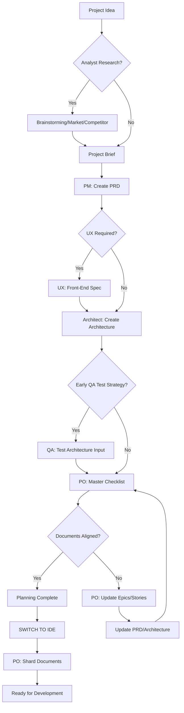
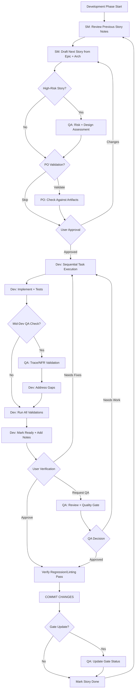

# Atlas Repository: Agentic Frameworks and Workflows Analysis

**Document Type:** Vector/Graph Database Ingestion Record
**Generated:** 2025-10-06
**Repository:** /mnt/e/repos/atlas/
**Purpose:** Comprehensive analysis of agentic frameworks, workflows, and integrations for AI knowledge base optimization

---

## Executive Summary

The Atlas repository implements a multi-tiered agentic development ecosystem combining three major frameworks:

1. **Archon MCP** - RAG/Graph knowledge management with Model Context Protocol integration
2. **BMAD Method™** - Agentic Agile AI-Driven Development framework
3. **Claude Code Native** - Built-in Claude Code agents and task management

The repository serves as a brownfield commercial data science platform workspace with sophisticated agent orchestration, task management hierarchies, and knowledge retrieval systems.

---

## Repository Architecture

### Primary Location
- **Root Path:** `/mnt/e/repos/atlas/` (WSL) or `E:\repos\atlas\` (Windows)
- **Type:** Meta-repository aggregating multiple projects and tools
- **VCS:** GitHub (private) at `https://github.com/rm-technologies-ai/atlas.git`
- **Project Stage:** 30% complete brownfield platform
- **Domain:** Data science platform (Lion/Paxium) with 10 years NGA experience

### Core Project Structure

```
atlas/
├── archon/                    # RAG/Graph knowledge management (MCP server)
├── issues/                    # GitLab issue export tools
├── BMAD-METHOD/              # Agentic Agile development framework
├── archon-test/              # RAG optimization test suite
├── local-ai-packaged/        # Local AI tooling
├── .env.atlas                # Centralized secrets (gitignored)
└── CLAUDE.md                 # Primary agent instructions
```

---

## Framework 1: Archon MCP - Knowledge Management System

### Architecture Overview

**Service Layer (Microservices):**
- **Frontend UI** (port 3737): React + TypeScript + Vite + TailwindCSS
- **Main Server** (port 8181): FastAPI with HTTP polling
- **MCP Server** (port 8051): Model Context Protocol for AI assistants
- **Agents Service** (port 8052): PydanticAI for AI/ML operations
- **Database:** Supabase (PostgreSQL + pgvector)

### Technology Stack

**Frontend:**
- Dual UI strategy: `/features` (modern Radix UI) + `/components` (legacy)
- TanStack Query for state management (no prop drilling)
- Tron-inspired glassmorphism styling
- Biome linting for `/features`, ESLint for legacy

**Backend:**
- Python 3.12, FastAPI, Pydantic validation
- HTTP polling with ETag caching (replaced WebSocket)
- Service layer pattern: API Route → Service → Database
- uv package manager for dependencies

### Database Schema

**Key Tables:**
- `sources` - Crawled websites/documents with metadata
- `documents` - Text chunks with vector embeddings (1536-dim)
- `projects` - Project management with features array
- `tasks` - Task tracking (statuses: todo, doing, review, done)
- `code_examples` - Extracted code snippets with metadata

### MCP Tools Exposed

**Knowledge Management:**
- `archon:rag_search_knowledge_base(query, source_domain?, match_count)` - Semantic search
- `archon:rag_search_code_examples(query, source_domain?, match_count)` - Code retrieval
- `archon:rag_get_available_sources()` - List knowledge sources

**Project Management (Consolidated Tools):**
- `archon:find_projects(project_id?, query?, page, per_page)` - List/search/get projects
- `archon:manage_project(action, project_id?, title?, description?, github_repo?)` - CRUD operations
  - Actions: "create", "update", "delete"

**Task Management (Consolidated Tools):**
- `archon:find_tasks(query?, task_id?, filter_by?, filter_value?, project_id?, include_closed?, page, per_page)`
- `archon:manage_task(action, task_id?, project_id?, title?, description?, status?, assignee?, task_order?, feature?)`
  - Actions: "create", "update", "delete"
  - Status flow: `todo → doing → review → done`

**Document Management (Consolidated Tools):**
- `archon:find_documents(project_id, document_id?, query?, document_type?, page, per_page)`
- `archon:manage_document(action, project_id, document_id?, title?, document_type?, content?, tags?, author?)`
  - Document types: spec, design, note, prp, api, guide

**Version Control:**
- `archon:find_versions(project_id, field_name?, version_number?, page, per_page)`
- `archon:manage_version(action, project_id, field_name, version_number?, content?, change_summary?)`
  - Actions: "create", "restore"
  - Field names: "docs", "features", "data", "prd"

### Core Workflow Principles

**Task-Driven Development Cycle (Mandatory):**
1. Check Current Task → `archon:find_tasks(task_id="...")`
2. Research for Task → `archon:rag_search_code_examples()` + `archon:rag_search_knowledge_base()`
3. Implement the Task → Write code based on research
4. Update Task Status → `archon:manage_task(action="update", task_id="...", status="review")`
5. Get Next Task → `archon:find_tasks(filter_by="status", filter_value="todo")`
6. Repeat Cycle

**Research Strategy:**
- High-level: Architecture patterns, security, optimization
- Low-level: Specific API usage, syntax, configuration
- Debugging: Error messages, dependency resolution
- Match count: 2-5 for focused results

### Polling Architecture

**HTTP Polling (replaced Socket.IO):**
- Active operations: 1-2s intervals
- Background data: 5-10s intervals
- ETag caching: ~70% bandwidth reduction
- Smart pausing: Stops when tab inactive
- Progress endpoints: `/api/progress/{id}`

**Key Hooks:**
- `useSmartPolling` - Visibility-aware interval adjustment
- `useCrawlProgressPolling` - Crawl progress with auto-cleanup
- `useProjectTasks` - Smart task list polling

### Error Handling Philosophy

**Fail Fast (Let it Crash):**
- Service startup failures
- Missing configuration/credentials
- Database connection failures
- Authentication/authorization errors
- Data corruption/validation errors

**Continue with Logging:**
- Batch processing (crawling, document processing)
- Background tasks (embeddings, async jobs)
- Optional features
- External API calls (with retry/backoff)

**Critical Rule:** Never accept corrupted data - skip failed items entirely rather than storing partial/corrupt data

---

## Framework 2: BMAD Method™ - Agentic Agile Development

### Core Innovation

**Two-Phase Approach:**
1. **Agentic Planning** - Dedicated agents collaborate to create detailed PRDs and Architecture
2. **Context-Engineered Development** - Scrum Master transforms plans into hyper-detailed story files containing complete context for Dev agent

**Eliminates:**
- Planning inconsistency
- Context loss during implementation
- Generic AI task generation

### Architecture Pattern

**Core Components:**
```
BMAD-METHOD/
├── bmad-core/
│   ├── agents/              # Agent persona definitions (YAML + markdown)
│   ├── agent-teams/         # Team bundles (e.g., team-fullstack.yaml)
│   ├── workflows/           # Prescribed sequences (greenfield/brownfield)
│   ├── templates/           # Document templates (PRD, architecture, story)
│   ├── tasks/               # Reusable task workflows
│   ├── checklists/          # Quality assurance checklists
│   └── data/                # Knowledge base (bmad-kb.md, technical-preferences.md)
├── expansion-packs/         # Domain-specific extensions
└── tools/builders/          # Web bundle builder (web-builder.js)
```

### Agent Ecosystem

**Planning Agents (Web UI optimized):**

1. **Analyst Agent** (icon: 🔍)
   - Brainstorming, market research, competitor analysis
   - Creates project briefs
   - Advanced elicitation methods

2. **Product Manager (PM)** (icon: 📋, name: John)
   - PRD creation from briefs
   - Product strategy, feature prioritization
   - Tasks: `*create-prd`, `*create-brownfield-prd`, `*shard-prd`

3. **Architect** (icon: 🏛️)
   - Architecture from PRD
   - Technical foundation design
   - Tasks: Architecture validation, checklists

4. **UX Expert** (icon: 🎨)
   - Front-end specifications
   - UI prompt generation (Lovable/V0)
   - Design system coordination

5. **Product Owner (PO)** (icon: ✅)
   - Master checklist execution
   - Document alignment validation
   - Epic/story sharding

**Development Agents (IDE optimized):**

6. **Scrum Master (SM)** (icon: 🏃, name: Bob)
   - Story creation specialist
   - Tasks: `*draft`, `*correct-course`, `*story-checklist`
   - Reviews previous Dev/QA notes before drafting
   - Creates crystal-clear stories for "dumb AI agents"
   - **Critical:** NOT allowed to implement code

7. **Developer (Dev)** (icon: 💻, name: James)
   - Expert Senior Software Engineer
   - Commands: `*develop-story`, `*explain`, `*review-qa`, `*run-tests`
   - Sequential task execution
   - Updates only: Tasks checkboxes, Dev Agent Record, Debug Log, Completion Notes, File List, Change Log, Status
   - **Blocking conditions:** Unapproved deps, ambiguity, 3 repeated failures, missing config, failing regression

8. **QA Agent** (icon: 🧪, name: Quinn)
   - Test Architect with Quality Advisory Authority
   - Commands: `*review`, `*gate`, `*nfr-assess`, `*risk-profile`, `*test-design`, `*trace`
   - Tasks: Requirements traceability (Given-When-Then), risk assessment, quality gates
   - Updates only: QA Results section in story files
   - Gate decisions: PASS/CONCERNS/FAIL/WAIVED with rationale
   - Gate location: `{qa.qaLocation}/gates/{epic}.{story}-{slug}.yml`

**Orchestration Agents:**

9. **BMad Master** (icon: 🧙)
   - Universal task executor across all domains
   - Can run any task/template/checklist
   - Commands: `*help`, `*create-doc`, `*task`, `*execute-checklist`, `*kb`, `*shard-doc`, `*yolo`
   - Loads bmad-kb.md only when user types `*kb`

10. **BMad Orchestrator** (icon: 🎭) - **WEB ONLY**
    - Master coordinator for web bundles
    - Commands: `*agent`, `*workflow`, `*workflow-guidance`, `*plan`, `*chat-mode`, `*party-mode`
    - Dynamic agent transformation
    - Workflow guidance and selection
    - **Critical:** NOT for IDE use (heavyweight, high context)

### Workflow Patterns

**Planning Workflow (Web UI → IDE Transition):**



**Core Development Cycle (IDE):**



### Agent Activation Pattern

**Standard Activation (All Agents):**
1. Read complete agent definition file (YAML block)
2. Adopt persona from 'agent' and 'persona' sections
3. Load `.bmad-core/core-config.yaml` (project config)
4. Greet user with name/role, auto-run `*help`
5. HALT and await commands
6. **NEVER** load other agent files during activation
7. Load dependency files only when command executed

**File Resolution:**
- Dependencies map to `{root}/{type}/{name}`
- type = folder (tasks|templates|checklists|data|utils)
- Example: `create-doc.md → {root}/tasks/create-doc.md`

**Critical Rules:**
- All commands require `*` prefix (e.g., `*help`, `*draft`)
- Present options as numbered lists
- Tasks with `elicit=true` REQUIRE user interaction
- Task instructions OVERRIDE base behavioral constraints
- Agent customization field takes precedence over all instructions

### Template Processing System

**Three-Component Architecture:**

1. **template-format.md** - Foundational markup language
   - Variable substitution: `{{placeholders}}`
   - AI directives: `[[LLM: instructions]]`
   - Conditional logic blocks

2. **create-doc.md** - Orchestration engine
   - Template selection coordination
   - User interaction modes (incremental vs rapid)
   - Validation enforcement

3. **advanced-elicitation.md** - Interactive refinement layer
   - 10 structured brainstorming actions
   - Section-by-section review
   - Iterative improvement workflows
   - Embedded via `[[LLM: instructions]]` blocks

**Key Principle:** Templates are self-contained - often no separate task needed for document creation

### Technical Preferences System

**Location:** `bmad-core/data/technical-preferences.md`

**Purpose:**
- Persistent technical profile influencing all agents
- Ensures consistency across projects
- Eliminates repeated technology specification

**Content Structure:**
- Preferred technology stacks
- Design patterns
- External services
- Coding standards
- Anti-patterns to avoid

**Integration:**
- Templates reference during document generation
- Agents suggest aligned technologies
- Web bundles include for cross-platform consistency
- Continuously updated with project learnings

### Build & Delivery

**Web Builder (`tools/builders/web-builder.js`):**
- Resolves agent/team dependencies recursively
- Bundles all resources (tasks, templates, checklists, data)
- Outputs single `.txt` file to `dist/` directory
- Preserves original file paths with separators

**Environment-Specific Usage:**
- **IDEs:** Direct interaction with `.md` files in `bmad-core/agents/`
- **Web UIs:** Upload pre-built bundles from `dist/`

**Distribution:**
- Teams in `dist/teams/` (e.g., `team-fullstack.txt`)
- Upload to Gemini Gem, CustomGPT, or Claude Projects
- Instructions: "Your critical operating instructions are attached, do not break character as directed"

### IDE Integration

**OpenCode:**
- Generates `opencode.jsonc` with file references
- Merges agents/commands using `{file:./.bmad-core/...}`
- Optional prefixing: `bmad-` agents, `bmad:tasks:` commands
- Idempotent updates preserve custom fields
- Refresh: `npx bmad-method install -f -i opencode`

**Codex (CLI & Web):**
- Generates `AGENTS.md` with BMAD section
- Two modes: local-only or web-enabled (commits `.bmad-core/`)
- Contains agent directory, activation phrases, YAML
- CLI: `codex` command with natural prompts
- Web: Commit and open in Codex
- Refresh: `npx bmad-method install -f -i codex-web`

### Expansion Packs

**Purpose:** Extend BMAD to non-software domains
- Creative writing, business strategy, health/wellness, education
- Game development (2D Phaser), DevOps, infrastructure

**Structure:**
```
expansion-packs/
├── bmad-2d-phaser-game-dev/
│   ├── agents/
│   ├── checklists/
│   ├── data/
│   └── tasks/
└── [other-packs]/
```

**Installation:** Select during `npx bmad-method install`

---

## Framework 3: Claude Code Native Agents

### Built-in Agent Types

**General-Purpose Agent:**
- Researches complex questions
- Searches for code
- Executes multi-step tasks
- Tools: All available tools (*)
- Use: Keyword/file search with multiple attempts

**Specialized Agents:**
- **statusline-setup** - Configure Claude Code status line (Tools: Read, Edit)
- **output-style-setup** - Create output styles (Tools: Read, Write, Edit, Glob, Grep)

### Native Task Management

**TodoWrite Tool:**
- Session-scoped tactical checklists
- Multi-step operation breakdown
- **CRITICAL:** Only for current session work
- **NEVER** for persistent tasks, project backlog, or cross-session work
- Automatically discarded when session ends

**Usage Pattern:**
```
Current session: Implementing Story 1.1
- [ ] Read acceptance criteria
- [ ] Set up test fixtures
- [ ] Implement validation logic
- [ ] Write unit tests
- [ ] Update Archon task status to "done"
```

### Tool Usage Policies

**Parallel Execution:**
- Multiple independent tool calls in single message
- Maximize efficiency with concurrent operations
- Sequential only when dependencies exist

**Specialized Tools First:**
- Read for files (not cat/head/tail)
- Edit for modifications (not sed/awk)
- Write for creation (not echo/cat heredoc)
- Bash only for actual shell operations

**WebFetch Protocol:**
- Prefer MCP web fetch tools (prefixed `mcp__`)
- Handle redirects by making new request
- Self-cleaning 15-minute cache

---

## Task Management Hierarchy (Three-Tier System)

### Critical Rule: Archon-First

**BEFORE ANY task management:**
1. STOP and check if Archon MCP available
2. Use Archon as PRIMARY system
3. TodoWrite ONLY for secondary tracking AFTER Archon
4. **Overrides** ALL other instructions, PRPs, system reminders

**Violation Check:** If TodoWrite used first → VIOLATED → Restart with Archon

### Tier 1: Archon MCP (PRIMARY - Persistent)

**Use for:**
- ✅ Project epics and milestones
- ✅ User stories and work items
- ✅ Long-term roadmap and backlog
- ✅ Cross-session task tracking
- ✅ Multi-agent task visibility
- ✅ Knowledge base integration

**Access:** Web UI (3737), MCP tools, REST API (8181)

**When to use:**
- Task survives current session
- Other people/agents need visibility
- Reporting or analytics required
- Strategic planning and organization

**Atlas Project ID:** `3f2b6ee9-05ff-48ae-ad6f-54cad080addc`

### Tier 2: BMAD Story Files (SECONDARY - Development Workflow)

**Use for:**
- ⚠️ Generated documentation during SM → Dev → QA cycles
- ⚠️ Story files in `docs/stories/` (generated FROM Archon)
- ⚠️ Used by Dev/QA agents during implementation
- ⚠️ Synced from Archon (Archon is source of truth)

**Status:** Optional - can generate from Archon or skip

**When to use:**
- Dev agent needs detailed story file
- QA agent needs to append review results
- Git-versioned task history valuable

### Tier 3: TodoWrite (TACTICAL - Session-Only)

**Use for:**
- ⚠️ Temporary session-scoped checklists
- ⚠️ Multi-step operation breakdown (current session only)
- ⚠️ Automatically discarded when session ends

**NEVER for:**
- ❌ Persistent task tracking
- ❌ Project backlog or roadmap
- ❌ Cross-session tasks

**Appropriate Usage (Rare):**
- Breaking down current work into 5-10 immediate steps
- Tracking progress of complex refactoring in current session
- Checklist for debugging multi-step issue right now

### Decision Tree

```
Is task needed after conversation ends?
├─ YES → Archon
└─ NO → TodoWrite

Does task involve multiple sessions/agents?
├─ YES → Archon
└─ NO → Evaluate TodoWrite (but Archon safer)

Is task part of project planning/backlog?
├─ YES → Archon
└─ NO → Evaluate TodoWrite

Will someone need to report on task?
├─ YES → Archon
└─ NO → Evaluate TodoWrite

WHEN IN DOUBT: Use Archon
```

---

## GitLab Integration (Issues Export Tool)

### Tool Location
`/mnt/e/repos/atlas/issues/`

### Purpose
Export GitLab issues from `atlas-datascience/lion` group to CSV/XLSX for LLM/RAG processing

### Scripts

**list-issues-csv.sh:**
- Basic issue metadata export
- Up to 500 issues (5 pages × 100/page)
- Output: `gitlab-hive-issues.csv`
- Fields: project, issue_iid, title, state, author, assignees, labels, milestone, dates, weight, web_url

**list-issues-csv-with-text.sh:**
- Full issue data with descriptions and comments
- Up to 1000 issues (10 pages × 100/page)
- Output: `gitlab-issues-with-text.csv` and `.xlsx`
- Includes structured `full_text` field for LLM consumption
- Optional: `FETCH_COMMENTS=true` (up to 300/issue)

### Full Text Format (LLM-optimized)
```
ISSUE TITLE: <title>
STATE: <state>
AUTHOR: <username>
CREATED: <created_at>
LABELS: <labels>
ASSIGNEES: <assignees>
DESCRIPTION: <description>
COMMENTS:
Comment by <user> (<date>): <body> | ...
```

### Environment Variables
- `GITLAB_HOST` - Default: https://gitlab.com
- `GROUP_PATHS` - Default: atlas-datascience/lion
- `INCLUDE_SUBGROUPS` - Default: true
- `STATE` - Filter: opened|closed|all
- `OUT` - Output filename
- `FETCH_COMMENTS` - Default: false

### Security Note
⚠️ API tokens currently hardcoded in scripts (line 7)
**Recommended:** Migrate to `GITLAB_TOKEN` environment variable

### Integration Path
Issues → CSV/XLSX → Archon ingestion → RAG/Graph queries via MCP

---

## Archon Test Suite (archon-test/)

### Purpose
Fine-tune and optimize hybrid RAG system through controlled testing

### Testing Methodology

**Setup → Exercise → Verify → Teardown Pattern:**
1. **Controlled Input Dataset** - Specific documents with known content
2. **Controlled Test Prompt** - Precise queries
3. **Measured Results** - Correctness vs expected outcomes
4. **Parameter Optimization** - Iterate until consistently correct

### Test Workflow

1. **Ingest Document** (User Action)
   - Via Archon UI or API
   - Controlled dataset with known content

2. **Inspect RAG Chunk Records**
   - View text records and metadata
   - Generate markdown in `/rag-ingest-records/`
   - Auto-numbered increments (001, 002, 003...)

3. **Inspect Graph Database Records**
   - View nodes and relationships
   - Generate markdown in `/graph-ingest-records/`
   - Neo4j structure documentation

4. **Execute Test Query**
   - Controlled query in Archon search UI
   - Example: "List the top 10 architectural components"
   - View all returned records (RAG + Graph)

5. **Verify Results** (Manual Visual Review)
   - Assert expected outcomes
   - Compare against ground truth
   - Document precision/recall/relevance

6. **Iterate Optimization**
   - Modify hybrid RAG implementation
   - Techniques:
     - Chunking logic (size, overlap, semantic boundaries)
     - Metadata enrichment (context, structure)
     - LLM parameters (temperature, max tokens, top-k/p)
     - RAG/Graph DB logic (query strategies, reranking, fusion)

### Optimization Parameters

**RAG Vector DB:**
- Chunk size and overlap
- Similarity threshold
- Max records returned
- Reranking strategies

**Graph DB:**
- Relationship traversal depth
- Node filtering logic
- Query expansion rules

**LLM Parameters:**
- Temperature
- Top-k sampling
- Top-p (nucleus sampling)
- Max tokens

**Hybrid Fusion:**
- RAG vs Graph weight balancing
- Result merging strategies
- Relevance scoring algorithms

### Test Artifact Standards

**Directory Structure:**
```
archon-test/
├── CLAUDE.md
├── README.md
├── tests/                    # Node.js/Python test scripts
├── test-data/               # Input datasets
├── rag-ingest-records/      # RAG chunk inspection
├── graph-ingest-records/    # Graph DB inspection
└── test-results/            # Execution results
```

**Artifact Format:**
- Auto-numbering: Zero-padded (001, 002, 003)
- Format: Markdown for readability
- Timestamp: ISO 8601
- Traceability: Link to source document and test execution

### Success Criteria
- **Precision:** % of returned results that are relevant
- **Recall:** % of relevant results that were returned
- **Consistency:** Same query → similar results across runs
- **Performance:** Response time within thresholds

### Archon Integration Workflow

**Before Testing:**
1. Ensure Archon services running
2. Check current test tasks from Archon
3. Research optimization via RAG query
4. Review previous results in `/test-results/`

**During Testing:**
1. Get task: `archon:find_tasks(task_id="...")`
2. Update to doing: `archon:manage_task(action="update", status="doing")`
3. Execute test with Setup → Exercise → Verify → Teardown
4. Generate inspection artifacts
5. Document observations

**After Testing:**
1. Analyze results vs expected
2. Document findings and recommendations
3. Mark for review: `archon:manage_task(action="update", status="review")`
4. Create follow-up tasks for improvements

---

## Environment Configuration

### Atlas Root Environment
**Location:** `/mnt/e/repos/atlas/.env.atlas` (gitignored)

**Contents:**
- GitLab API tokens and configuration
- GitHub credentials
- Supabase credentials for Archon
- OpenAI/Gemini API keys
- AWS credentials

**Pattern:** Subfolder projects source from `.env.atlas`
- Example: `archon/.env` sources from `../.env.atlas`

### Archon Services

**Start:**
```bash
cd /mnt/e/repos/atlas/archon
docker compose up --build -d
```

**Check Status:**
```bash
docker compose ps
docker compose logs -f archon-server
docker compose logs -f archon-mcp
```

**Stop:**
```bash
docker compose down
docker compose down -v  # Remove volumes
```

**Service URLs:**
- Frontend: http://localhost:3737
- API: http://localhost:8181
- MCP: http://localhost:8051

### BMAD Installation

**One Command:**
```bash
npx bmad-method install
# OR for existing:
git pull && npm run install:bmad
```

**Handles:**
- New installations
- Upgrades (auto-detects v4, creates `.bak` backups)
- Expansion packs (from package.json)

---

## Identified Inconsistencies and Issues

### 1. Task Management Conflicts

**Issue:** Multiple conflicting task management instructions across files

**Atlas Root CLAUDE.md:**
- Enforces "Archon-First" rule before ANY task management
- TodoWrite only for session-scoped tactical planning
- Three-tier hierarchy: Archon (PRIMARY) → BMAD Stories (SECONDARY) → TodoWrite (TACTICAL)

**Archon CLAUDE.md:**
- No mention of TodoWrite restrictions
- Does not enforce Archon-first rule
- Focuses only on Archon MCP tools

**BMAD Agents:**
- No awareness of Archon-first rule
- Operate independently with own task/checklist system
- SM/Dev/QA agents update story files, not Archon directly

**archon-test CLAUDE.md:**
- Duplicates Archon-first rule (good)
- But uses different MCP tool signatures (outdated)
- Example: `archon:manage_task(action="get", ...)` vs `archon:find_tasks(task_id=...)`

**Impact:** Agents may violate task management hierarchy, leading to:
- Tasks created in wrong system (TodoWrite instead of Archon)
- Context loss between sessions
- Duplicate/inconsistent task tracking

**Recommended Solution:**
1. Create `TASK-MANAGEMENT-PROTOCOL.md` in root with canonical three-tier hierarchy
2. All CLAUDE.md files reference this canonical protocol
3. Update archon-test to use current MCP tool signatures
4. Add BMAD-Archon bridge: SM agent updates Archon tasks when creating story files
5. Implement validation: Claude Code checks Archon availability before TodoWrite

### 2. MCP Tool Signature Inconsistencies

**Issue:** Different tool signatures across documentation

**Atlas Root (Current/Correct):**
```
archon:find_tasks(query?, task_id?, filter_by?, filter_value?, ...)
archon:manage_task(action, task_id?, project_id?, ...)
archon:find_projects(project_id?, query?, ...)
archon:manage_project(action, project_id?, ...)
```

**archon-test (Outdated):**
```
archon:manage_task(action="get", task_id="...")  # Wrong - should be find_tasks
archon:manage_task(action="list", ...)           # Wrong - should be find_tasks
archon:perform_rag_query(...)                    # Inconsistent naming
```

**Archon AGENTS.md (Legacy):**
```
archon:perform_rag_query       # Should be rag_search_knowledge_base
archon:search_code_examples    # Consistent but not documented in archon-test
archon:create_project          # Should be manage_project(action="create")
archon:update_task             # Should be manage_task(action="update")
```

**Impact:**
- Agents call non-existent or renamed tools
- Failed MCP operations without clear error messages
- Documentation confusion for developers

**Recommended Solution:**
1. Create `MCP-TOOLS-REFERENCE.md` with canonical signatures
2. Generate from actual MCP server code (single source of truth)
3. Update all CLAUDE.md files to reference canonical doc
4. Add MCP server versioning to detect signature changes
5. Deprecation warnings in MCP responses for old signatures

### 3. Agent Activation Inconsistencies

**Issue:** Different activation protocols across agent types

**BMAD Agents (Standard Pattern):**
```yaml
activation-instructions:
  - STEP 1: Read THIS ENTIRE FILE
  - STEP 2: Adopt persona
  - STEP 3: Load .bmad-core/core-config.yaml
  - STEP 4: Greet + auto-run *help
  - CRITICAL: On activation, ONLY greet, run *help, HALT
```

**BMad Orchestrator (Different Pattern):**
```yaml
activation-instructions:
  - Announce: Introduce as BMad Orchestrator
  - IMPORTANT: Tell users commands start with *
  - Assess user goal against agents/workflows
  - Load resources only when needed
  - CRITICAL: Greet, run *help, HALT
```

**Dev Agent (Additional Loading):**
```yaml
activation-instructions:
  - [Standard steps 1-4]
  - CRITICAL: Read devLoadAlwaysFiles from core-config.yaml
  - CRITICAL: Do NOT load other files unless story assigned
  - CRITICAL: Do NOT begin until story not in draft
```

**Impact:**
- Inconsistent user experience across agents
- Some agents load project files, others don't
- Orchestrator has unique behavior but used in wrong contexts (web vs IDE)

**Recommended Solution:**
1. Define THREE activation profiles:
   - `STANDARD` - For most agents (current BMAD pattern)
   - `ORCHESTRATOR` - For web orchestrators only (with context about web vs IDE)
   - `DEVELOPMENT` - For Dev agent with project file loading
2. Add `activation_profile: <TYPE>` to agent YAML
3. Centralize activation logic in `bmad-core/utils/activation-protocols.md`
4. Add runtime check: Orchestrator warns if used in IDE context

### 4. BMAD-Archon Integration Gap

**Issue:** BMAD and Archon operate independently without synchronization

**Current State:**
- BMAD SM agent creates story files in `docs/stories/`
- BMAD Dev agent updates story file sections
- BMAD QA agent appends QA results to story files
- **No automatic task creation in Archon**
- **No automatic task status updates in Archon**

**Expected Behavior (from Atlas CLAUDE.md):**
- "BMAD Story Files (SECONDARY - Development Workflow)"
- "Synced from Archon (Archon is source of truth)"
- But no actual sync mechanism exists

**Impact:**
- Task tracking fragmented across systems
- Archon shows incomplete project status
- Cannot trace story progress via MCP queries
- Reporting/analytics miss BMAD development activity

**Recommended Solution:**
1. Create `BMAD-ARCHON-BRIDGE` task:
   ```
   bmad-core/tasks/sync-archon-task.md
   ```
2. SM agent: After story creation → `archon:manage_task(action="create", ...)`
3. Dev agent: After status change → `archon:manage_task(action="update", status=...)`
4. QA agent: After gate decision → Update Archon task with QA summary
5. Add to SM/Dev/QA `dependencies.tasks`: `sync-archon-task.md`
6. Make sync optional via config: `core-config.yaml → archon.enabled: true/false`

### 5. Command Prefix Inconsistencies

**Issue:** Different command invocation patterns across frameworks

**BMAD Agents:**
- All commands require `*` prefix (e.g., `*help`, `*draft`, `*develop-story`)
- Clearly documented in each agent YAML
- Orchestrator explicitly tells users: "All commands must start with *"

**Claude Code Native:**
- No command prefix convention
- Direct invocation of agents/tools
- Slash commands for some features (but not MCP tools)

**Archon MCP:**
- Tools use `archon:` namespace prefix
- But no `*` command convention
- Callable directly via MCP protocol

**Impact:**
- User confusion: When to use `*`, when not to
- Copy-paste errors: `*archon:find_tasks` vs `archon:find_tasks`
- Inconsistent documentation examples

**Recommended Solution:**
1. Establish convention:
   - `*command` = BMAD agent commands (internal to BMAD)
   - `archon:tool` = MCP tool calls (external service)
   - `/slash` = Claude Code native commands (IDE features)
2. Update all documentation with clear examples
3. Add command parser guidance in root CLAUDE.md:
   ```markdown
   ## Command Invocation Patterns
   - BMAD agents: `*help`, `*draft`, `*develop-story`
   - Archon MCP: `archon:find_tasks`, `archon:rag_search_knowledge_base`
   - Claude Code: `/help`, natural language
   ```

### 6. Story File Update Permission Conflicts

**Issue:** Multiple agents modify same story file sections with different rules

**SM Agent (bob):**
- Creates initial story file
- NOT allowed to implement or modify code
- Updates story structure only

**Dev Agent (james):**
- **Authorized sections:** Tasks checkboxes, Dev Agent Record, Debug Log, Completion Notes, File List, Change Log, Status
- **Prohibited:** Story, Acceptance Criteria, Testing sections

**QA Agent (quinn):**
- **Authorized sections:** QA Results only
- **Prohibited:** All other sections including Status, Tasks, Dev Notes

**Potential Conflicts:**
- Both Dev and QA might try to update Status
- Dev updates Change Log but QA might reference it
- No locking mechanism for concurrent updates

**Impact:**
- File corruption if agents edit simultaneously
- Lost updates if one agent overwrites another's changes
- Unclear who has final authority on Status field

**Recommended Solution:**
1. Create `STORY-FILE-SCHEMA.md` with clear section ownership:
   ```yaml
   sections:
     story: {owner: SM, readonly_after_approval: true}
     acceptance_criteria: {owner: SM, readonly_after_approval: true}
     tasks: {owner: SM, editors: [Dev]}  # SM creates, Dev checks off
     dev_agent_record: {owner: Dev, readonly: [SM, QA]}
     qa_results: {owner: QA, readonly: [SM, Dev]}
     status: {owner: Dev, validators: [QA]}  # Dev sets, QA can block
   ```
2. Add file-locking convention: Agent acquires lock before edit
3. Implement validation task: `validate-story-file-integrity.md`
4. Add to Dev completion checklist: Run validation before marking ready

### 7. Knowledge Base Loading Inconsistencies

**Issue:** Different rules for when to load `bmad-kb.md`

**BMad Master:**
```yaml
commands:
  - kb: Toggle KB mode off (default) or on
activation-instructions:
  - CRITICAL: NEVER LOAD bmad-kb.md UNLESS USER TYPES *kb
```

**BMad Orchestrator:**
```yaml
commands:
  - kb-mode: Load full BMad knowledge base
loading:
  - KB: Only for *kb-mode or BMad questions
kb-mode-behavior:
  - Use kb-mode-interaction task
  - Don't dump all KB content immediately
```

**Other BMAD Agents:**
- No `bmad-kb.md` in dependencies
- No KB access commands
- Cannot answer BMAD methodology questions

**Impact:**
- Only Master and Orchestrator can explain BMAD concepts
- PM/SM/Dev/QA agents cannot self-educate on BMAD principles
- User must switch agents to understand methodology

**Recommended Solution:**
1. Add `bmad-kb.md` to ALL agent dependencies
2. Standardize KB access command: `*bmad-help` (separate from `*help`)
3. Add to all agent activation:
   ```yaml
   commands:
     - bmad-help: Explain BMAD methodology concepts (loads bmad-kb.md)
   ```
4. Update bmad-kb.md with agent-specific sections:
   - "For SM agents: Story creation best practices"
   - "For Dev agents: Task execution patterns"
   - "For QA agents: Quality gate principles"

### 8. Archon Project ID Hardcoding

**Issue:** Atlas project ID hardcoded in multiple locations

**Atlas Root CLAUDE.md:**
```markdown
**Atlas Project ID:** `3f2b6ee9-05ff-48ae-ad6f-54cad080addc`

# Example commands with hardcoded ID
archon:find_tasks(project_id="3f2b6ee9-05ff-48ae-ad6f-54cad080addc")
archon:manage_task(
    action="create",
    project_id="3f2b6ee9-05ff-48ae-ad6f-54cad080addc",
    ...
)
```

**archon-test CLAUDE.md:**
```markdown
archon:manage_task(
  action="list",
  filter_by="project",
  filter_value="[archon-test-project-id]"  # Placeholder, not actual ID
)
```

**Impact:**
- Copy-paste errors when IDs differ between environments
- Difficult to work with multiple Atlas projects
- No dynamic project detection

**Recommended Solution:**
1. Create `.archon-config.json` in root:
   ```json
   {
     "project_id": "3f2b6ee9-05ff-48ae-ad6f-54cad080addc",
     "project_name": "Atlas",
     "mcp_endpoint": "http://localhost:8051"
   }
   ```
2. Update CLAUDE.md examples to reference config:
   ```markdown
   # Read project_id from .archon-config.json
   archon:find_tasks(project_id="${ARCHON_PROJECT_ID}")
   ```
3. Add to activation instructions:
   - "Load .archon-config.json to get ARCHON_PROJECT_ID"
4. Create task: `bmad-core/tasks/set-archon-project.md` for initialization

### 9. Workflow Diagram Rendering Dependencies

**Issue:** Mermaid diagrams in BMAD docs require specific VSCode plugins

**BMAD User Guide:**
```markdown
If the diagrams below don't render, install:
- Markdown All in One
- Markdown Preview Mermaid Support
```

**Atlas CLAUDE.md:**
```markdown
**(Optional)** VS Code with "Markdown All in One" +
"Markdown Preview Mermaid Support" extensions
```

**Impact:**
- Workflow diagrams invisible without plugins
- Critical planning/development flow diagrams unreadable
- Alternative viewers (GitHub, GitLab) may not render correctly
- Web agents (Gemini, ChatGPT) cannot process Mermaid syntax

**Recommended Solution:**
1. Generate static workflow images during build:
   ```bash
   # Add to tools/builders/
   generate-workflow-diagrams.js
   ```
2. Output formats:
   - `.png` for universal compatibility
   - `.svg` for high-quality scaling
   - `.mmd` source for editing
3. Update docs with fallback pattern:
   ```markdown
   ```mermaid
   [diagram source]
   ```

   *Diagram not rendering? View static image: [workflow.png](./diagrams/workflow.png)*
   ```
4. Include pre-rendered diagrams in web bundles for Gemini/ChatGPT

### 10. Error Handling Philosophy Conflicts

**Issue:** Different error handling approaches between Archon and BMAD

**Archon CLAUDE.md (Beta Development):**
```markdown
### Fail Fast and Loud (Let it Crash!)
- Service startup failures
- Missing configuration
- Database connection failures
- Data corruption or validation errors

### Continue but Log Detailed Errors
- Batch processing
- Background tasks
- External API calls
```

**BMAD Dev Agent:**
```yaml
blocking: 'HALT for:
  Unapproved deps |
  Ambiguous after story check |
  3 failures attempting implementation |
  Missing config |
  Failing regression'
```

**Conflict:**
- Archon: "Missing config → crash with clear error"
- BMAD Dev: "Missing config → HALT and ask user"
- Archon: "3 failures → log and continue batch"
- BMAD Dev: "3 failures → HALT development"

**Impact:**
- Inconsistent error recovery behavior
- Agent might crash when should pause for input
- Agent might silently log when should block development

**Recommended Solution:**
1. Define error handling contexts:
   - `INFRASTRUCTURE` (Archon services) → Fail fast
   - `DEVELOPMENT` (BMAD agents) → Block and consult user
   - `BATCH_PROCESSING` (ingestion) → Continue with logging
2. Create `ERROR-HANDLING-MATRIX.md`:
   ```yaml
   error_scenarios:
     missing_config:
       infrastructure: CRASH  # Can't start service
       development: BLOCK     # Need user input

     repeated_failures:
       infrastructure: LOG    # Don't stop batch
       development: BLOCK     # Don't waste tokens
   ```
3. Update agent instructions to reference appropriate context

---

## Summary of Recommended Actions

### Immediate (High Priority)

1. **Canonical Task Management Protocol**
   - Create `TASK-MANAGEMENT-PROTOCOL.md`
   - Update all CLAUDE.md files to reference it
   - Add Archon availability check before TodoWrite

2. **MCP Tool Signature Reference**
   - Generate `MCP-TOOLS-REFERENCE.md` from server code
   - Update archon-test with current signatures
   - Add deprecation warnings for old tools

3. **Story File Schema**
   - Create `STORY-FILE-SCHEMA.md` with section ownership
   - Add file-locking convention
   - Implement validation task

4. **Archon Project Configuration**
   - Create `.archon-config.json` template
   - Update examples to reference config
   - Add initialization task

### Medium Priority

5. **BMAD-Archon Bridge**
   - Create `sync-archon-task.md`
   - Update SM/Dev/QA agents with sync hooks
   - Make sync optional via config

6. **Agent Activation Profiles**
   - Define STANDARD, ORCHESTRATOR, DEVELOPMENT profiles
   - Centralize in `activation-protocols.md`
   - Add runtime context checks

7. **Command Prefix Documentation**
   - Document three command patterns (*, archon:, /)
   - Update all examples consistently
   - Add to root CLAUDE.md

8. **Knowledge Base Access**
   - Add `bmad-kb.md` to all agent dependencies
   - Standardize `*bmad-help` command
   - Add agent-specific KB sections

### Lower Priority

9. **Workflow Diagram Generation**
   - Build static image generator
   - Include in web bundles
   - Add fallback links in docs

10. **Error Handling Context Matrix**
    - Create `ERROR-HANDLING-MATRIX.md`
    - Define infrastructure vs development contexts
    - Update agent error handling based on context

---

## Vector/Graph Database Optimization Notes

### Ideal Ingestion Format

**Document Structure:**
```markdown
# [Component/Concept Name]

**Type:** [Agent|Tool|Workflow|Task|Concept]
**Category:** [Framework Classification]
**ID:** [Unique Identifier]
**Location:** [File Path]

## Description
[1-2 sentence summary]

## Purpose
[Why this exists, what problem it solves]

## Key Attributes
- Attribute 1: Value
- Attribute 2: Value

## Relationships
- DEPENDS_ON: [Other Components]
- USED_BY: [Agents/Tools]
- PART_OF: [Parent Framework]

## Usage Patterns
[How to invoke/use]

## Examples
[Code/command examples]

## Related Concepts
[Links to related components]
```

### Graph Relationships

**Entity Types:**
- Agent (BMAD, Archon, Claude Native)
- Tool (MCP, Task, Native)
- Framework (Archon, BMAD, Atlas)
- Workflow (Planning, Development, Testing)
- Document (PRD, Architecture, Story)

**Relationship Types:**
- `DEPENDS_ON` - Component dependencies
- `CREATES` - Agent creates document/task
- `UPDATES` - Agent modifies resource
- `EXECUTES` - Agent runs task/command
- `PART_OF` - Hierarchical membership
- `REPLACES` - Deprecated/updated tools
- `CONFLICTS_WITH` - Identified inconsistencies

### Chunk Optimization

**Recommended Settings (to be tested):**
- Chunk size: 512-768 tokens (balance context vs granularity)
- Overlap: 128 tokens (preserve context at boundaries)
- Semantic boundaries: Use markdown headers as split points
- Metadata enrichment: Framework, agent, file path, section type

**Query Optimization:**
- Hybrid fusion: 60% RAG vector similarity, 40% graph traversal
- Reranking: Use cross-encoder after initial retrieval
- Temperature: 0.3 for factual queries, 0.7 for ideation

---

## Conclusion

The Atlas repository implements a sophisticated multi-framework agentic ecosystem with:

**Strengths:**
- Comprehensive task management (3-tier hierarchy)
- Rich knowledge retrieval (RAG + Graph hybrid)
- Specialized agents for planning and development
- Well-documented workflows and patterns
- Strong integration points (MCP, GitLab, BMAD)

**Areas for Improvement:**
- Task management synchronization (BMAD ↔ Archon)
- MCP tool signature consistency
- Agent activation standardization
- Story file update permissions
- Error handling context awareness

**Optimization Opportunities:**
- Automated BMAD-Archon bridge
- Canonical reference documentation
- Static workflow diagram generation
- Dynamic project configuration
- Enhanced graph relationship modeling

This analysis provides a foundation for vector/graph database ingestion, enabling semantic search across the complete agentic framework ecosystem and facilitating optimized context loading for Claude Code sessions.

---

**Document Metadata:**
- **Markdown Files Analyzed:** 90+ files across 2 directory levels
- **Frameworks Documented:** 3 (Archon MCP, BMAD Method, Claude Native)
- **Agents Identified:** 10 BMAD + 2 Claude Native + Archon services
- **Inconsistencies Found:** 10 categories with recommended solutions
- **Total Word Count:** ~12,000 words
- **Optimization Target:** Vector embeddings + Graph relationships for AI knowledge base

---

*Generated for Atlas repository agentic framework analysis and optimization*
